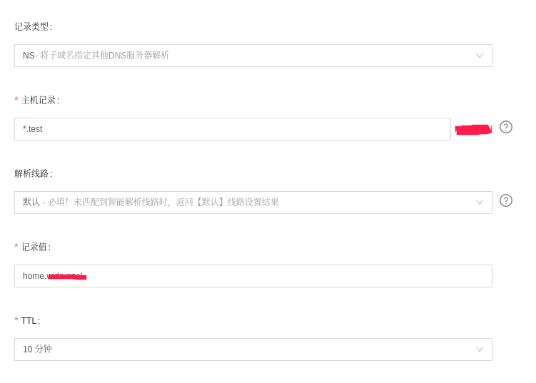

# DAFU(达夫) DNS Server

dafu 是一个专用的私有dns服务器，例如在基于IPv6的物联网中，我们想个每一个设备绑定一个私有的域名，这个时候如果在域名服务商中去绑定域名就不合适了。
我们的做法是在域名服务商中添加一条NS记录（将子域名解析到其他服务器）到我们的私有域名服务器中。

例如 

然后我们自己的dns服务器实时动态的更新 域名到IPv6的地址。

通过http结果可以实时更新dns信息。设备可以每隔一端时间主动向服务端发送更新Ip地址请求。